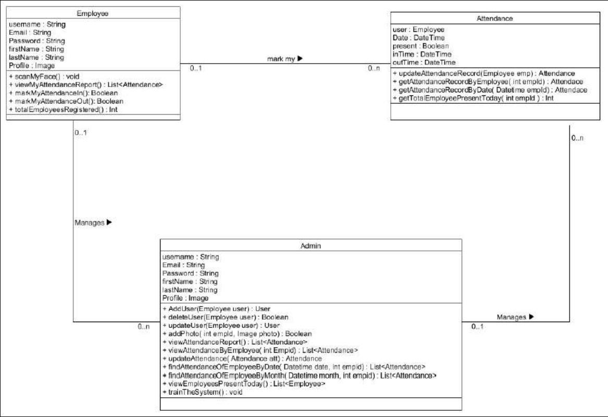
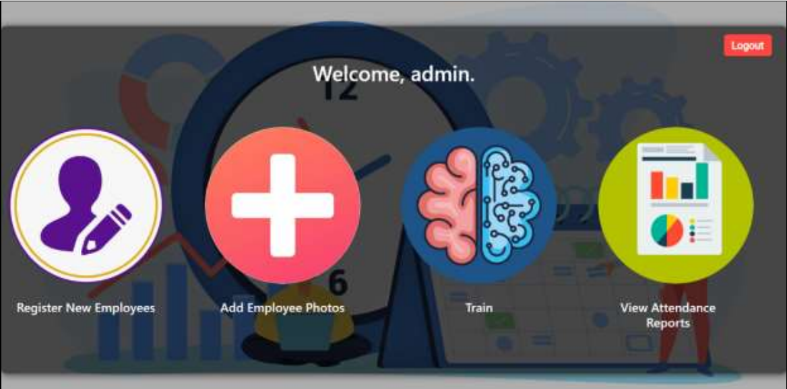
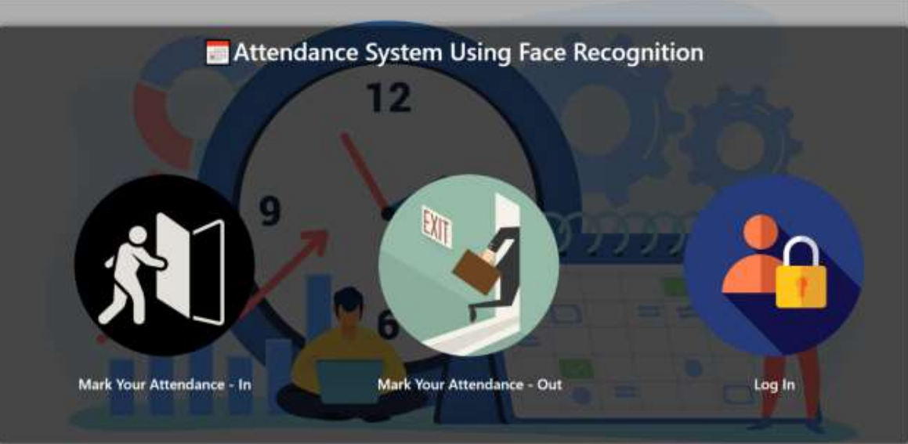
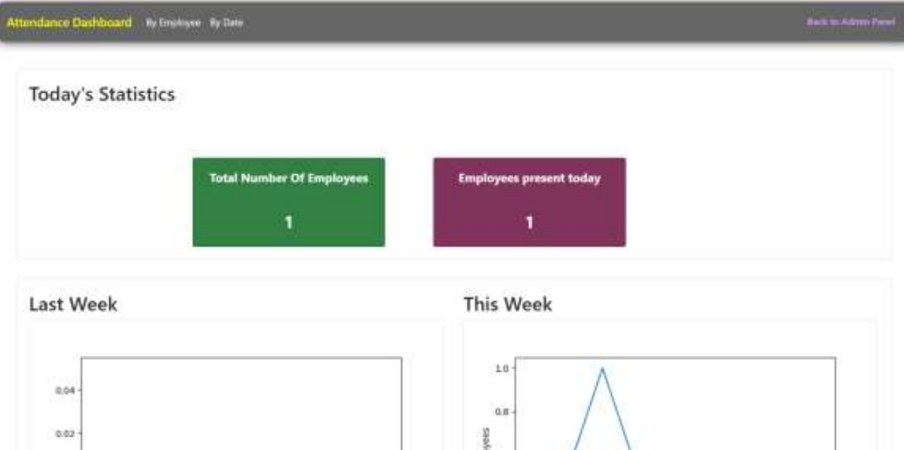

# Attendance_System_using_Face_Recognition

## INTRODUCTION :

The goal of this project is to create an attendance system that tracks employee presence, time-in,
and time-out using facial recognition. The construction of a web application to support a variety
of system use cases, including the registration of new employees, the contribution of images to the
training dataset, the viewing of attendance records, etc., is also covered in this paper, which also
covers issues like facial detection, alignment, and identification. The system utilizes advanced
image processing and artificial intelligence algorithms to recognize individuals' faces and
automatically mark their attendance. This technology provides several benefits over traditional
attendance methods, including improved accuracy, efficiency, and convenience. It can also reduce
the risk of fraudulent activities such as proxy attendance. This project aims to be a productive
replacement for outdated manual attendance systems. When security is a priority, it can be
employed in corporate offices, educational institutions, and other organizations.  

# PROBLEM STATEMENT :

The traditional methods of taking attendance in educational institutions and corporate offices, such
as paper-based sign-in sheets or manual roll-calls, are time-consuming, inefficient, and prone to
errors. These methods can also be easily manipulated, leading to inaccurate attendance records and
potential fraudulent activities, such as proxy attendance. Additionally, during the ongoing COVID-
19 pandemic, traditional attendance methods pose a risk of spreading the virus due to physical
contact.  
To address these challenges, an attendance system using face recognition technology can provide
a viable solution. This system can automatically recognize and verify individuals' faces, reducing
the need for manual intervention and eliminating the risk of fraudulent activities. Moreover, there
is a need for a comprehensive evaluation of the system's effectiveness, reliability, and scalability
to ensure its suitability for various applications and settings.  

## SCOPE AND IMPORTANCE :

In modern society, facial recognition is becoming more prevalent. In the area of security, it has
achieved significant advancements. It is a very useful tool that can assist law enforcement in
identifying criminals, and software providers are utilizing the technology to make it easier for
people to access the technology. This technology can be improved to be used in several
contexts, such as ATMs, accessing private files, or handling other delicate materials.
The traditional attendance system, where attendance is manually recorded, will be automated
as part of this project. Additionally, it enables an organization to digitally preserve its
attendance, break time, in-time, and out-of-time data. The system's digitization would also aid
in a better data visualization employing graphs to show the number of personnel now present,
their cumulative work hours, and their break times. With its new features, the conventional
attendance system is effectively upgraded and replaced.

## DESIGN :
It is a collection of processes that facilitate the designing, development, implementation and maintenance of enterprise data management systems. It helps produce database systems:

- That meet the requirements of the users.
- Have high performance.

### FLOWCHART

### TRAINING DATA FOR THE SVM ALGORITHM :

## GUI SCREENSHOTS :

Admin Dashboard

Register Window

Homepage

Previous Week Data in Graph

## CONCLUSIOIN :

An attendance system using face recognition is a powerful tool that can streamline attendance
management and improve security in various settings such as schools, workplaces, and events. The
system works by capturing facial images of individuals and using machine learning algorithms
such as SVM to identify and track attendance.

## STEPS TO RUN THIS APPLICATION :

## CONTRIBUTING :

This is an open source project, and contributions of any kind are welcome and appreciated. Open issues, bugs, and feature requests are all listed on the [issues](https://github.com/harshd23/Attendance_System_using_Face_Recognition/issues) tab and labeled accordingly. Feel free to open bug tickets and make feature requests.

## CONTRIBUTORS :

© 2023 Harsh Dalvi and contributors  
This project is licensed under the [**MIT license**](https://github.com/harshd23/Attendance_System_using_Face_Recognition/blob/main/LICENSE).

